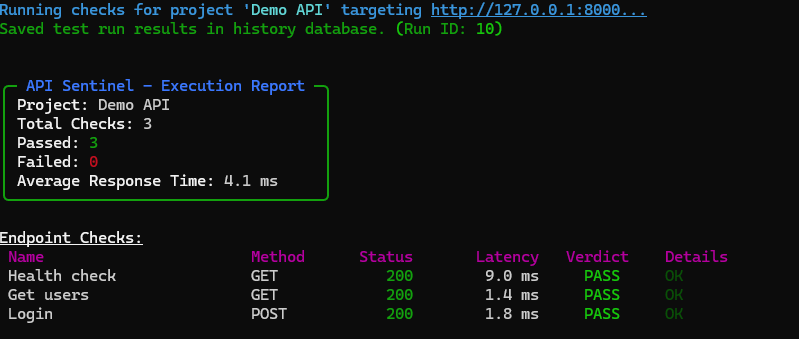
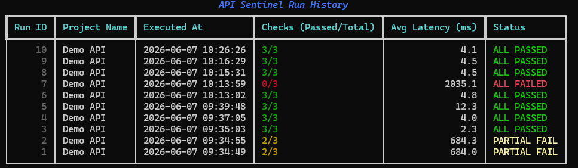
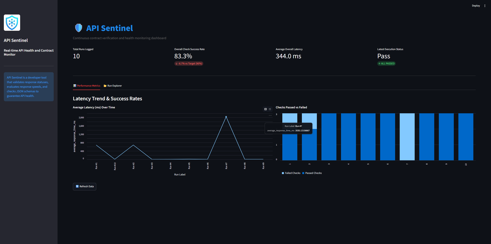

<p align="center">
  
</p>

# API Sentinel

A lightweight API health check and contract testing tool for developers.

API Sentinel is a local, configuration-driven utility designed to help developers validate HTTP API responses, measure latency, verify response structures, and track execution history.

---

## Features

- **Configuration-Driven**: Define check suites in a simple JSON file.
- **Contract & Field Validation**: Helps validate that response status codes match expectations and checking for the presence of specific top-level or nested keys (e.g., `user.email`).
- **HTTP client execution**: Powered by `httpx` to support common HTTP verbs (GET, POST, PUT, DELETE, PATCH) with timeout limits.
- **Local History Tracking**: Records run metrics and check logs into a local SQLite database file.
- **Rich Terminal Reports**: Colorized console outputs summarizing execution pass rates and individual endpoint statuses.
- **Local Web Dashboard**: Built with Streamlit for inspecting historical runs and viewing latency trends.

---

## Tech Stack

- **Python**: Core runtime
- **HTTP Client**: `httpx`
- **Configuration Parsing**: `pydantic` (v2)
- **CLI Commands**: `typer`
- **Terminal Formats**: `rich`
- **Database**: SQLite (built-in standard library)
- **Dashboard**: `streamlit`
- **Tests**: `pytest`

---

## Project Structure

```text
api_sentinel/
├── __init__.py          # Package initializer
├── cli.py               # Typer commands implementation
├── config_loader.py     # JSON loader and Pydantic validator
├── database.py          # SQLite schema creation and queries
├── models.py            # Pydantic schema representations
├── runner.py            # httpx check executor
├── validator.py         # Response status, latency, and field existence checks
├── dashboard.py         # Streamlit dashboard script
examples/
├── api_checks.json      # Sample config file
└── demo_api.py          # FastAPI mock API for testing
tests/
├── test_config_loader.py
├── test_runner.py
└── test_validator.py
.github/
└── workflows/
    └── tests.yml        # CI Pipeline setup
main.py                  # CLI entrypoint script
requirements.txt         # Package dependencies list
pytest.ini               # Test configuration
```

---

## Installation

1. **Clone the Repository**:
   ```bash
   git clone https://github.com/egeyasar0/api-sentinel.git
   cd api-sentinel
   ```

2. **Set up a Virtual Environment**:
   ```bash
   python -m venv .venv
   # On Windows:
   .venv\Scripts\activate
   # On macOS/Linux:
   source .venv/bin/activate
   ```

3. **Install Dependencies**:
   ```bash
   pip install -r requirements.txt
   ```

---

## Running the Demo API

A FastAPI mock API is provided to test the tool locally without calling external services.

Start the demo server:
```bash
python -m uvicorn examples.demo_api:app --reload
```
The server will run on `http://127.0.0.1:8000`.

---

## Creating Configuration via Wizard

To create a configuration file interactively without manually writing JSON:
```bash
python main.py init-config
```
This command prompts you for project metadata, authentication details, and the checks you want to add, and exports them directly to a JSON file.

---

## Running API Checks

To execute the check suite against your API:
```bash
python main.py run --config examples/api_checks.json
```

---

## Viewing History

To view a summary of all past runs recorded in the local SQLite database:
```bash
python main.py history
```

---

## Exporting Reports

To retrieve detailed statistics for a specific run in JSON format:
```bash
python main.py report --run-id 1
```

To export the run data as raw JSON (useful for integration with other tools):
```bash
python main.py export --run-id 1 --format json
```

---

## Running the Dashboard

To view history and latency metrics in a local browser interface:
```bash
streamlit run api_sentinel/dashboard.py
```

---

## Running Tests

Automated tests can be executed with `pytest` from the root directory:

```bash
pytest
```

For verbose output:
```bash
pytest -v
```

---

## Authentication Support

API Sentinel provides basic, environment-variable based authentication support for API health checks. It supports:
- **No Auth**: No authorization header will be attached.
- **Bearer Token**: Reads a Bearer token value from a configured environment variable name at runtime and injects `Authorization: Bearer <value>`.
- **API Key Header**: Reads an API key value from a configured environment variable name at runtime and injects `<key_name>: <value>`.

### Design Guidelines:
- Real secrets are resolved dynamically from your environment at execution runtime. **They are never stored in the configuration file.** The configuration file only contains the *name* of the environment variable.
- Auth headers and secrets are never printed in CLI reports or recorded in the local SQLite history database to prevent credential leaks.
- Avoid committing configuration files that contain real credentials (always use environment variables).

---

## Example Config

An example configuration file (`examples/api_checks.json`) looks like this:

```json
{
  "project_name": "Demo API",
  "base_url": "http://127.0.0.1:8000",
  "checks": [
    {
      "name": "Health check",
      "method": "GET",
      "path": "/health",
      "expected_status": 200,
      "max_response_time_ms": 500,
      "expected_fields": ["status"]
    },
    {
      "name": "Get users",
      "method": "GET",
      "path": "/users",
      "expected_status": 200,
      "max_response_time_ms": 1000,
      "expected_fields": ["users"]
    },
    {
      "name": "Login",
      "method": "POST",
      "path": "/login",
      "expected_status": 200,
      "max_response_time_ms": 1000,
      "body": {
        "email": "test@example.com",
        "password": "password123"
      },
      "expected_fields": ["token", "user.email"]
    }
  ]
}
```

---

## Screenshots

### CLI Execution Report



### Run History



### Streamlit Dashboard



---

## Future Improvements

- **Scheduled Checks**: Run suites periodically (cron-like execution).
- **Notifications**: Send alerts to Webhooks (Slack, Discord) or Email upon check failure.
- **Dynamic Header Authentication**: Fetch tokens from an authentication endpoint before running subsequent checks.
